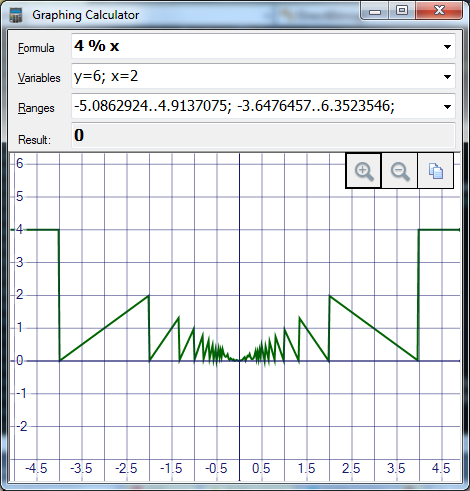
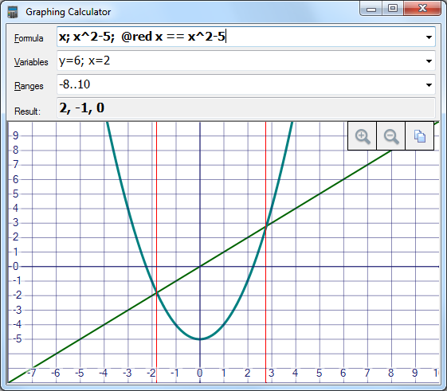
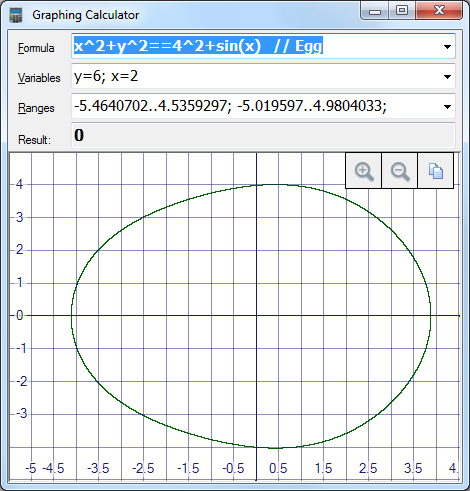
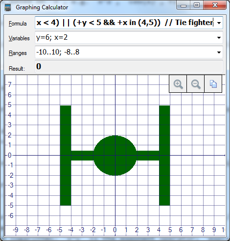
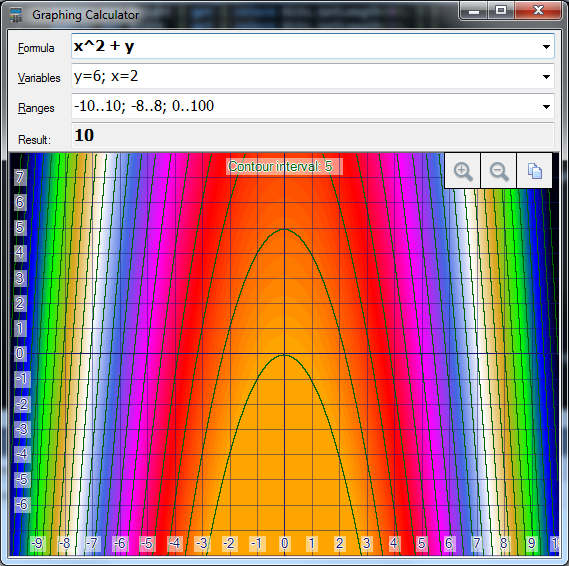
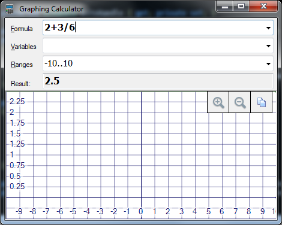
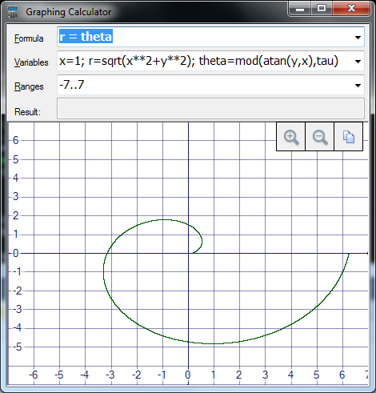
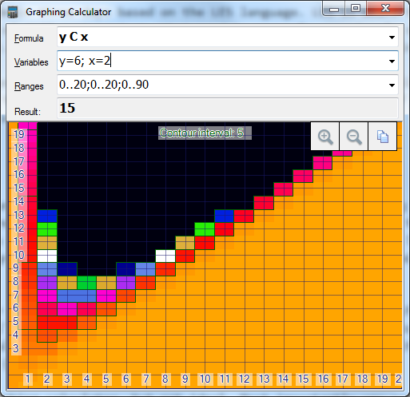

C# Graphing Calculator based on LES
===================================

I made a nice calculator in three days based on the LES language. LES is meant to be a "universal" expression language, so it's useful for a variety of different projects that need to parse "expressions", such as a graphing calculator. Since the parser comes from the Loyc.Syntax library, I didn't have to make an expression parser for the calculator itself.

Instead I was able to focus on making the best darn calculator I could in as few lines of code as I could. In addition, the computational part reduces the lines of code further using Enhanced C#. However, most of the program is written in plain C#.

What is LES?
------------

If you're not a programmer, skip this section.

First I'll tell you what LES is not. It is not a programming language. And it wasn't designed for graphing calculators, either. It is only a syntax: the _meaning_ of LES code is defined entirely by a host application or host programming language.

LES is designed to be a "universal" expression language based on the C programming language. LES has all the same operators as C with roughly the same precedence, except that certain operators are not allowed to be mixed; for example `x & 7 == 0` causes an error because in C this means `x & (7 == 0)` instead of what you expect, `(x & 7) == 0`. For the same reason, you can't write `x << 1 + 1` (a programmer naturally expects the shift operators to have similar precedence to multiplication, but they don't).

Technically the calculator uses the third version of LES, LESv3, which makes no difference. LESv3 only has three keywords, `true`, `false`, and `null`, but none of these are useful in the graphing calculator since the calculator is designed to work with numbers only. LESv3 also allows C-like "statement expressions" which start with a dot, such as `.if x < 0 { print("negative!") } else { }`. Again, the calculator does not use this feature (it uses `c ? a : b` instead).

C syntax is okay for a graphing calculator, but not ideal. Most importantly you can't write math-like expressions like `2x^2` or `(x+1)(x-1)` or `sin x`; instead, write `2*x^2` or `(x+1)*(x-1)` or `sin(x)`. In fact, `2*x^2` doesn't really work in LES either; although the `^` operator exists, it was meant to be the "xor" operator so it has the wrong precedence, i.e. `2*x^2` = `(2*x)^2`. You don't have to worry about that when using the calculator, though: I programmed it replace `^` with `**` (`**` is the intended exponentiation operator in LES).

Another issue is that LES has an unlimited number of operators, but the precedence of each one is fixed based on the text of the operator. For example you could write `x *+ y`, and `*+` would be a new operator with the same precedence as `*`. In the graphing calculator this is a nuisance, because when you write `x*-sin(x)`, `*-` is seen as one operator, not two. The calculator solves this problem by inserting spaces where appropriate (`Regex.Replace(text, @"([-+*/%^&*|<>=?.])([-~!+])", "$1 $2")`).

One nice thing about LES is that it supports attributes (which are like Java annotations or C# attributes). You can use attributes to configure the appearance of the output.

LES parses into [Loyc trees](http://loyc.net/loyc-trees), a universal representation for syntax trees. This happens to be the same representation used by the [Enhanced C#](http://ecsharp.net) programming language.

Key features
------------

**Draws formulas** based on `x`, e.g. `x^2`, `cos(x)`, floor(x)`. You can write **multiple data series** (multiple formulas) separated by semicolons (e.g. "x; x^2").

**Equalities** using the `==` operator, e.g. `x^2+y^2 == 3^2` is a circle of radius 3 (sorry, the `=` operator is glitched and may cause an error right now. I'll fix that eventually.)

**Inequalities and boolean expressions** using `> < >= <= && ||`

**Pseudo-3D**: Although there's no 3D renderer, you can make "heat maps" with contour lines instead. Contour lines are drawn along routes where the output stays constant:

**Single result**: If you just want to do a single calculation, there's no need to mention `x` or `y`. You can also do multiple calculations separated by semicolons, e.g. `2+2; 3*3; 4^4`.

**Variables** let you define shortcuts for numbers or subexpressions.

Lots of different operators and functions are supported (see below).

Points of interest
------------------

One thing I tried for the first time in this project is to make a ClickOnce installer. This was as simple as going to the "Publish" page in the project settings and clicking "Publish Now". Unfortunately, instead of being a single msi file like a normal installer is, it's a whole collection of files. Also, the setup.exe file that it generates is larger than the entire rest of the project. So ClickOnce seems to have a lousy design, but it sure was easy to use!

The program uses WinForms because it loads faster than WPF. The part of the project that does computations (Calculators.ecs) is designed to be independent, so it is "unaware" of WinForms.

Did you know? Combo boxes in WinForms are buggy. I encountered three `ComboBox` bugs while writing this! I found workarounds for two, but the third bug I just accepted: sometimes multiple combo boxes are painted as if they have the keyboard focus.

### Parsing expressions with LES ###

Parsing expressions with LES is easy. Just use NuGet to add Loyc.Syntax.dll to your project, and then do

    var tree = LesLanguageService.Value.ParseSingle("x + 1", new ConsoleMessageSink())
    
to parse the expression "x + 1" into a [Loyc tree](http://loyc.net/loyc-trees) while printing errors to the console. Just add `using Loyc.Syntax` and `using Loyc` directives to fix those red squiggly underlines. And if you'd like to get a list of errors, use a `new MessageHolder()` instead of `ConsoleMessageSink` ([click here](http://core.loyc.net/essentials/messagesink.html) to learn about the "message sink" logging system; error locations are expressed with [SourceRange](http://ecsharp.net/doc/code/structLoyc_1_1Syntax_1_1SourceRange.html).)

After parsing, you can then use properties and methods on the Loyc tree to examine it. For example, 

- `tree.Calls(CodeSymbols.Add, 2)` returns true, so you can tell it calls the `+` operator with two arguments.
- `tree.Name` returns the symbol `'+` (that's the value of `CodeSymbols.Add`; see [CodeSymbols](http://ecsharp.net/doc/code/classLoyc_1_1Syntax_1_1CodeSymbols.html)).
- `tree.Args[0]` gets the first argument.
- If you feel like replacing all references to the addition operator `'+` with calls to the "Add" method, you could write

        tree = tree.ReplaceRecursive(n => n.Calls(CodeSymbols.Add) ? 
                                     n.WithName((Symbol)"Add") : null);

- To construct the expression `x + 1` programmatically, you can write

        tree = LNode.Call(CodeSymbols.Add, LNode.List(
                          LNode.Id("x"), LNode.Literal(1)));

This concludes my basic tutorial of Loyc trees.

### Computing in the background with BackgroundWorker ###

`BackgroundWorker` is a standard .NET framework class that manages a single backgroun thread. I used it to run all computations _and_ to draw the output.

Here's how I used the `BackgroundWorker` in my main form (`CalcForm`):

1. It's important to avoid sharing state between the GUI and the background thread. Therefore, I defined the `OutputState` class to hold all settings (formulas, variables, ranges) and to store all results (`double` values for every X pixel, or every X-Y pair) and the output bitmap. `OutputState` also contains the drawing code, because despite all my years of experience, the [Single Responsibility Principle](https://en.wikipedia.org/wiki/Single_responsibility_principle) still seems too hard. Note that a new bitmap is created every frame; if you try to share the bitmap between the two threads, it _usually_ works, but sometimes `InvalidOperationException` occurs ("Object is currently in use elsewhere").
2. The GUI thread creates a `OutputState` class and starts the `BackgroundWorker` if it is not busy. If it **is** busy then a boolean `_refreshRequested` is set to `true`.
3. I added a delegate to the `DoWork` event; this is the code that runs on the background thread. It `Run()s` the calculator for each formula and then calls `OutputState.RenderAll()` to draw. Note that the `BackgroundWorker` automatically catches any exceptions in the background thread.
4. The `RunWorkerCompleted` event runs on the GUI thread. This delegate's job is to show the error message (if an exception occurred) or put the completed bitmap on the screen (if no errors occurred). Finally, if `_refreshRequested == true`, a new `RefreshDisplay()` is called to start the update that couldn't be done earlier.

### Calculating formulas with Enhanced C# ###

Enhanced C# is a programming language that I developed over the past few years - well, it's a _partial_ programming language right now. It's quite usable; I have written thousands of lines of code in it. However, I need volunteers to help finish it. What it does right now is enable a feature called the "lexical macro processor" or LeMP, which adds LISP-style macros to C#.

It works as a single-file generator. You [install](http://ecsharp.net/lemp/install) the Visual Studio plug-in, write a single file in Enhanced C#, and then Visual Studio generates a normal C# file for you. The nice thing about this is that other people can compile your project without having the Visual Studio plug-in, because the C# file is also part of your project.

The macro system adds a variety of features via syntactic transforms. You can write your own macros, but most people will just use the built-in macros.

First of all, it provides a new kind of constructor which you can see in action in my calculator:

    class CalcRange
    {
        // Generate a constructor and three public fields
        public this(public number Lo, public number Hi, public int PxCount)
        {
            StepSize = (Hi - Lo) / Math.Max(PxCount - 1, 1);
        }
        ....
    }

The generated code looks like this.

	class CalcRange {
		public double Lo;
		public double Hi;
		public int PxCount;
		// Generate a constructor and three public fields
		public CalcRange(double lo, double hi, int pxCount)
		{
			Lo = lo;
			Hi = hi;
			PxCount = pxCount;
			StepSize = (Hi - Lo) / Math.Max(PxCount - 1, 1);
		}
        ...
    }

Second, there's a thing called `alt class` that generates an entire class hierarchy (it's comparable to the algebraic data types in languages such as F#, Haskell, Rust, Nemerle, etc.). For example:

	public abstract alt class Tree<T> 
		where T: IComparable<T>
	{
	  alt this(T Value); // Constructor of base class `Tree<T>`
	  alt Leaf();        // Derived class Leaf<T> inherits (T Value) constructor
	  alt Node(Tree<T> Left, Tree<T> Right); // "Node" constructor has 3 params
	}

The "alt class" macro is used to help generate the two kinds of calculator, `Calculator2D` (which computes formulas of `x`) and `Calculator3D` (which computes formulas of `x` and `y`), as well as the base class, `CalculatorCore`.

Third, my code occasionally uses "global" `Symbol`s, which are like strings except that they are singletons (for a particular string, only a single instance of `Symbol` holds that string). In Enhanced C# I can refer to a symbol with the special syntax `@@name`, e.g. `@@x` is the symbol for the identifier `x`.

Loyc trees use Symbols instead of strings to represent the names of identifiers (a.k.a. "Ids") like `x`, `y`, and `sqrt`. The advantage of `Symbol` is that, because there is only one `Symbol` for a given string, we can tell if two symbols are equal just by comparing pointers (`object.ReferenceEquals`).

A `Symbol` just represents a name. Meanwhile, a syntax tree has type `LNode` (short for "Loyc tree node") and its `Name` property is a `Symbol`. `LNode` also holds other information, such as child nodes and the range of source code locations represented by the node.

Last but not least, I use the `matchCode` macro to examine and evaluate syntax trees. It basically works like a switch statement, except that it works on _code_ instead of on ordinary values. Here is a simple example:

    var vars = new Dictionary<Symbol, LNode>();
    foreach (LNode assignment in varList) {
		matchCode (assignment) {
			case $var = $expr:    // Detect assignment expression
				// Two variables have been created, `var` and `expr`, 
				// holding the left and right sides of the assignment.
				if (!var.IsId)
					throw new ArgumentException("Left side of '=' must be an identifier: {0}".Localized(var));
				vars.Add(var.Name, expr);
			default:
				throw new ArgumentException("Expected assignment with '=': {0}".Localized(assignment));
	};

`matchCode` is designed to operate on Loyc trees. Since the LES and Enhanced C# languages _both_ produce Loyc trees, `matchCode` can be used with syntax trees from both of these languages.

**Technical note**: since the code itself is written in Enhanced C#, the syntax tree that appears after `case` is actually an Enhanced C# tree, not an LES tree. But when it comes to simple expressions like `x + y` or `sin(x)`, the trees produced by the two languages are virtually identical. Because of that, I can easily use `matchCode` in EC# to deconstruct LES trees.

Here's the `Eval()` function which computes expressions using `matchCode`. For brevity, the binary operators are left out.

    public static number Eval(LNode expr, Func<Symbol, number> lookup)
    {
        if (expr.IsLiteral) {
            if (expr.Value is number)
                return (number)expr.Value;
            else
                return (number)Convert.ToDouble(expr.Value);
        }
        if (expr.IsId)
            return lookup(expr.Name);

        // expr must be a function or operator
        if (expr.ArgCount == 2) {
            ...
        }
        // Other stuff
        matchCode (expr) {
            case -$a: return -Eval(a, lookup);
            case +$a: return Math.Abs(Eval(a, lookup));
            case !$a: return  Eval(a, lookup) == 0 ? (number)1 : (number)0;
            case ~$a: return (number)~(long)Eval(a, lookup);
            // In LES, the conditional operator a?b:c is actually two separate binary 
            // operators named '? and ': ... you can also write "a if b else c" but it 
            // is parsed as "a if (b else c)".
            case @`'?`($c, @`':`($a, $b)):
                return Eval(c, lookup) != (number)0 ? Eval(a, lookup) : Eval(b, lookup);
            case square($a):  return Eval(a, lookup)::n * n;
            case sqrt($a):    return Math.Sqrt(Eval(a, lookup));
            case sin($a):     return Math.Sin(Eval(a, lookup));
            case cos($a):     return Math.Cos(Eval(a, lookup));
            case tan($a):     return Math.Tan(Eval(a, lookup));
            case asin($a):    return Math.Asin(Eval(a, lookup));
            case acos($a):    return Math.Acos(Eval(a, lookup));
            case atan($a):    return Math.Atan(Eval(a, lookup));
            case sec($a):     return 1/Math.Cos(Eval(a, lookup));
            case csc($a):     return 1/Math.Sin(Eval(a, lookup));
            case cot($a):     return 1/Math.Tan(Eval(a, lookup));
            case exp($a):     return Math.Exp(Eval(a, lookup));
            case ln($a):      return Math.Log(Eval(a, lookup));
            case log($a):     return Math.Log10(Eval(a, lookup));
            case ceil($a):    return Math.Ceiling(Eval(a, lookup));
            case floor($a):   return Math.Floor(Eval(a, lookup));
            case sign($a):    return Math.Sign(Eval(a, lookup));
            case abs($a):     return Math.Abs(Eval(a, lookup));
            case rnd():       return (number)_r.NextDouble();
            case rnd($a):     return (number)_r.Next((int)Eval(a, lookup));
            case fact($a):    return Factorial(Eval(a, lookup));
        }
        throw new ArgumentException("Expression not understood: {0}".Localized(expr));
    }

The data type `number` is not a true data type; it was defined at the beginning of the file as 

    using number = System.Double;

41 Features in about 1000 lines of code*
========================================

That's about 25 lines per feature!

\* *Not including the 300 lines generated by the Windows forms designer*

List of operators
-----------------

1. Operators for basic arithmetic: `+ - * / %` (`*` is multiply, `/` is divide, `%` is the C/C# modulus operator. **Note:** For a proper remainder operator, use `mod(x,y)`, e.g. `mod(-2,10)` is 8 while `-2 % 10` is -2.)
2. Exponents and logarithms: `x^y` is the exponent operator; `exp(x)` means `e^x`. `log(x)` is the base-10 logarithm; `ln(x)` is the natural logarithm. `log(x,base)` gets a logarithm in a specific base, e.g. `log(16,2)` is 4.
3. Multiply or divide by a power of two: `<< >>`, e.g. `4>>3` equals `4/8` equals 0.5.
4. Trigonometry: `sin(x) cos(x) tan(x)`, `sec(x) csc(x) cot(x)`, and inverses `asin(x) acos(x) atan(x)`. **Note:** These are based on radians, not degrees. If you define a variable `deg=pi/180`, you can express a quantity in degrees like `sin(30*deg)`.
5. Min/max: `min(x,y)` returns x or y, whichever is less. `max(x,y)` returns x or y, whichever is more. Sorry, more than two arguments are not currently supported.
6. Miscellaneous: `sqrt(x)` equals `x^0.5`, `square(x)` equals `x^2`, `sign(x)` is the _sign_ of `x`: -1 if negative, 1 if positive, 0 if 0. `floor(x)` rounds down to the nearest integer; `ceil(x)` rounds up to the nearest integer. `fact(x)` returns the factorial of x. `abs(x)`, which can also be written `+x`, gets the absolute value (removes the minus sign).
7. Compare two numbers: `== != > < >= <=`. The `!=` operator means "not equal". The calculator produces a result of 1 if the relationship holds and 0 if not. For example, `x > 3` is a step function: it equals zero at 3 or below, and one above 3. 
8. Range test and clamping: `x in (1,5)` returns true if `x >= 1 and x <= 5`. `x clamp (1,5)` moves `x` up to 1 if it is below 1, and down to 5 if it is above 5.
9. Logical operators: `&&` means "and", `||` means "or". `a && b` is 1 if both `a` and `b` are not zero. `a || b` is 1 if either `a` and `b` are not zero. There is a "not" operator called `!`; `!x` is 1 if `x==0`, and 0 otherwise. Finally there is an exclusive-or operator: `a xor b` is 1 if `a` or `b` are not zero, but it is zero if **both** `a` and `b` are not zero.
10. Conditional operator: The operator `cond ? yes : no` checks whether `cond` is "true" (meaning, not zero). If `cond` is not zero then `yes` is returned, otherwise `no`. For example, try `x>0 ? x : x^2` for a stylish V shape.
11. Bit fiddling: `x & y`, `x | y`, `xor(x,y)` and `~x` convert their arguments to 64-bit integers and then perform a bitwise and, or, xor, or inversion.
12. Error recovery operator: The expression `left ?? right` returns `left` if it is a real number, or `right` if `left` is infinity or not-a-number (NaN). For example `1/0 ?? 5` equals 5.
13. Random number generator: rnd() for floating-point between 0 and 1, rnd(n) for integer between 0 and n-1, rnd(x,y) for integer between x and y-1
14. LES supports the literals `@@inf.d` or `@@nan.d` for infinity and not-a-number, respectively (`.d` = double-precision). LES requires a space character after `.d` if it is followed by an operator.
15. Permutations and combinations: `n P r` computes the number of sequences of `r` items when choosing from a bag of `n` items without replacement; it equals `fact(n) / fact(n-r)`. `n C r` computes the number of sets of `r` items when choosing from a bag of `n` items without replacement; it equals `fact(n) / fact(r)*fact(n-r)`.
16. Supports hex and binary literals (however, all outputs are in decimal).

Other features
--------------

17. It draws a frickin' graph! How awesome is that?
18. A reasonable set of lines is chosen based on the viewport range. For example if the range is `1..4`, lines will be shown at 1.0, 1.25, 1.5, 1.75, 2, 2.25, and so on.
19. There are numeric labels along the sides.
20. You can drag the graph to pan. This works by changing the text in the "Ranges" combo box, which in turn redraws the graph
21. You can use the mouse wheel to zoom in and out, or click the zoom in and zoom out buttons.
22. There's a handy button to copy the graph image to the clipboard.
23. Graph state is saved on exit and restored on startup (careful: not designed for multiple instances)
24. You can "save" a formula into the combo box by pressing Enter (after clicking the formula). You can save a set of variables or a Range option the same way.
25. The graph can show multiple series, e.g. try `x; x^2; x^3`
26. Immediate result (bold text, above graph, left side)
27. Mouse-over result (bold text, above graph, right side), which can show multiple results if there are multiple series.
28. You can define variables on the second line. Variable definitions must be separated with semicolons. There are four predefined variables: `pi=3.14159265358979; tau=6.28318530717959; e=2.71828182845905; phi=1.61803398874989`
29. Variables can refer to other variables, including x and y. For example `r=sqrt(x^2+y^2)` defines `r` as the distance from the origin, and `theta=mod(atan(y,x),tau)` gets the angle between the current point and the origin, in radians, as a number between 0 and `2*pi` (then, set Formula to `r=theta` to see a spiral.)
30. The program will select the Y range automatically if the Ranges box contains only an X range, e.g. put `-10..10` in the range box and then try `x` and `x^2`. Note: the auto-range always includes -0.5 to 1.
31. You can compute an equality in two variables numerically with the `==` operator, e.g. `x^2+y^2 == 5^2` is a circle of radius 5. **Note:** in this mode the line thickness is always one pixel. That's because the calculator actually _doesn't_ draw a line. How it actually works is that if you write `x^2+y^2 == 5^2`, the calculator computes `x^2+y^2 - 5^2` for every pixel and then sets all the pixels where `Math.Sign(z)` is different in adjacent pixels (where `z` is the result). You can also solve a single-variable equation like `x==4/x`, but it will be graphed as though there were two variables.
32. Supports boolean functions or inequalities in two variables. For example, the following expression looks like a Tie Fighter: `x^2+y^2 < 4 || (+y < 0.5 && +x < 4) || (+y < 5 && +x in (4,5))`
33. Produces pseudo-3D "heat maps" when you write an expression with two variables. Here's a cool example: `cos(x)+cos(y)^3+sqrt(+(x*y))`.
34. Contour lines on the heat map. To disable this feature, write `@transparent` before the formula (you can also write a color name, like `@black`)
35. Normally the range of the heat map is auto-detected, and the 8 bands of color have no constant meaning (e.g. green may mean 6 when viewing one part of the graph, but if you pan around, it could mean something else). However, you can "lock in" to a specific range by adding a third range (called the "z" range) to the ranges list. For example, if you write `-10..10; -8..8; -4..4` in the Ranges box, then the colors and contour lines will represent **only** the range -4 to 4, and the colors will have a fixed meaning: Orange=-4, Red=-3, Magenta=-2, Royal Blue=-1, White=0, Yellow=1, Green=2, Pure Blue=3, Black=4.
36. You can set the color of a series by writing `@colorname` before the formula. For example, `@red x^2` shows a red parabola.
37. You can set the line thickness of a series to 5 pixels by writing `@5` before the formula, e.g. `@5 x^2`.
38. You can make dashed or dotted lines by writing `@dash`, `@dot`, `@dashdot`, or `@dashdotdot` before the formula. Example: `@blue @dot @10 x*cos(x)`.
39. You can change the color of the graph lines by writing a color name before the range, e.g. `@purple -8..8; @teal -5..5`
40. You can change the approximate number of graph lines by writing a desired number of lines as an `@attribute` before the range, e.g. `@0 -8..8; @30 -5..5`. The default is 20.
41. All graphs are computed and rendered on a background thread, which is good for x-y plots because they are rendered kind of slowly (sorry).

Missing features
----------------

Some features are notably missing:

1. No complex numbers
2. No true 3D view
3. No support for arrays/matrices or loops, no way to define functions, etc.
4. A few common functions are missing: GCD, LCM, prime/composite detection, ...
5. Optimizations: if you write multiple series and modify one of them, they are *all* recomputed. Also, plots of X-Y formulas are recomputed for every pixel, and the renderer and especially the expression evaluator are a bit slow for heavy-duty work.

Other than that I hope you'll find this calculator is quite nice as a replacement for Windows Calculator.

If somebody wants to fork this code and add those features, great! Note that LES supports "custom numeric literals" (where `LNode.Value is CustomLiteral`) so it could support imaginary numbers written like `-3i`, for example. It also supports lists of values written like `[1,2,3,4,5]`; these are represented by calls to `CodeSymbols.Array`.

The Calculators.ecs module is already designed to support data types other than `double`. Simply change the line 

	using number = System.Double;

to 

	using number = System.Numerics.Complex;

and then fix all the resulting errors. Unfortunately, the _rest_ of the program is not designed for complex numbers and you'll have to think carefully about how you might display them graphically.
